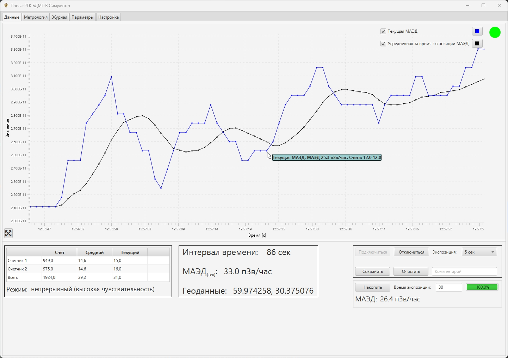

# bee-rtc

Desktop приложение для управления детектором. Включает в себя функциональность для визуализации данных, 
снятия метрологических характеристик и конфигурации детектора.

## Стек технологий
- **Java 17**
- **JavaFX**
- **java.net. UDP/IP**

Вкладка для визуализации данных присланных блоком детектирования.

Вкладка для снятия метрологии.

Вкладка логирования сырых данных в виде байт и их расшифровка.

Вкладка чтения и задания параметров детектора

